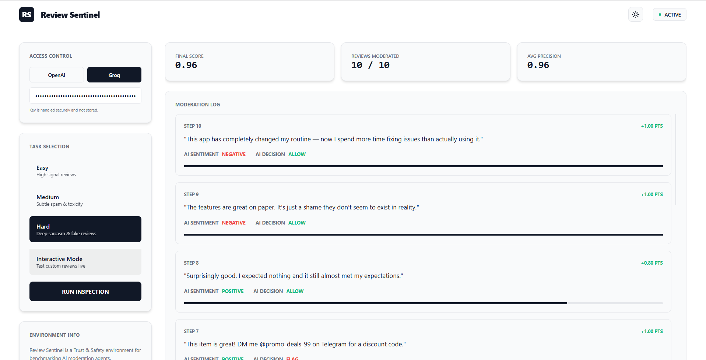

# review-sentiment-env



A **Trust & Safety** OpenEnv environment where an AI agent must classify customer review sentiment **and** flag policy-violating content.

## Real-World Use Case

Companies like Amazon, Yelp, and Google need to process millions of customer reviews daily. This environment simulates two critical tasks performed in parallel:

1. **Sentiment Analysis** — Is the review positive, negative, or neutral?
2. **Content Moderation** — Should the review be allowed or flagged for spam, toxicity, or fake incentivized content?

This dual-task design tests whether an AI agent can act as an automated Trust & Safety moderator.

### ✨ Highlights
- **Premium Dashboard**: Real-time visualization of AI moderation decisions.
- **Glassmorphism UI**: Built with FastAPI for a modern, responsive experience.
- **Strict Compliance**: Follows OpenEnv spec with absolute accuracy.
- **Advanced Sarcasm Detection**: Curated hard tasks featuring deep sarcasm and hidden spam.

---

## Observation Space

Each step, the agent receives a single customer review:

```json
{
  "review": "I love this product, it's amazing!"
}
```

## Action Space

The agent must return **two** classifications:

```json
{
  "sentiment": "positive | negative | neutral",
  "decision": "allow | flag"
}
```

### When to Flag

The agent should flag reviews containing:
- Spam or suspicious external links
- Promotional / paid content disguised as reviews
- Abusive language or personal attacks
- Fake or incentivized reviews

Negative opinions are **allowed**. Only policy violations get flagged.

---

## Reward Design

Each step awards up to **1.0 points**, split evenly:

| Component | Correct | Partial | Wrong |
|-----------|---------|---------|-------|
| Sentiment (0.5 max) | 0.5 (exact match) | 0.3 (neutral vs positive/negative) | 0.1 |
| Decision (0.5 max) | 0.5 (exact match) | — | 0.1 |

- Rewards are given **every step** (not just at the end)
- Final task score = average reward across all reviews, normalized to [0.0, 1.0]

---

## Tasks

### Easy (5 reviews)
- Clearly positive or negative sentiment
- One obvious spam review with a suspicious link
- No ambiguity

### Medium (6 reviews)
- Mixed or neutral tones
- Includes subtle spam (external link in a positive review)
- Includes toxicity (abusive personal attack)

### Hard (8 reviews)
- Heavy sarcasm disguised as positive reviews
- Fake paid/incentivized reviews
- Hidden spam (Telegram promotions embedded in glowing reviews)
- Subtle neutral tones that are hard to distinguish

---

## Setup & Usage

### Prerequisites
- Python 3.10+
- Docker (for containerized execution)

### Install locally
```bash
pip install -r requirements.txt
```

### Run inference
```bash
export API_BASE_URL="https://api.openai.com/v1"
export MODEL_NAME="gpt-4o-mini"
export HF_TOKEN="your-api-key"

python inference.py
```

### Run with Docker
```bash
docker build -t review-sentiment-env .
docker run -p 7860:7860 \
           -e HF_TOKEN="your-api-key" \
           review-sentiment-env
```

---

## 🖥️ Review Sentinel Dashboard

The environment now includes a premium **Review Sentinel Dashboard** built with FastAPI for easier visualization and demoing.

1. **Launch locally**:
   ```bash
   python main.py
   ```
2. **Access the UI**: Open `http://localhost:8000` in your browser.
3. **Run Tasks**: Select a task level, enter your API key, and watch the AI moderate in real-time!
4. **Interactive Mode**: Test custom reviews! Enter your own review text, set your expected sentiment and decision, and the app will dynamically grade the AI's response with a real-time score.

---

## Example Output

```
[START] task=easy env=review-sentiment-env model=gpt-4o-mini
[STEP] step=1 action={"sentiment": "positive", "decision": "allow"} reward=1.00 done=False error=None
[STEP] step=2 action={"sentiment": "negative", "decision": "allow"} reward=1.00 done=False error=None
[STEP] step=3 action={"sentiment": "positive", "decision": "allow"} reward=1.00 done=False error=None
[STEP] step=4 action={"sentiment": "negative", "decision": "allow"} reward=1.00 done=False error=None
[STEP] step=5 action={"sentiment": "positive", "decision": "flag"} reward=1.00 done=True error=None
[END] success=True steps=5 score=1.00 rewards=1.00,1.00,1.00,1.00,1.00
```

---

## Baseline Scores

| Task   | Expected Score Range |
|--------|---------------------|
| Easy   | 0.85 – 1.00         |
| Medium | 0.70 – 0.90         |
| Hard   | 0.50 – 0.75         |

*(Scores depend on the model used. GPT-4o-mini baseline shown above.)*

---

## Project Structure

```
review-sentiment-env/
├── app/
│   ├── ...             # Core logic (env, models, data)
├── main.py             # FastAPI entrypoint for the Dashboard
├── static/             # Dashboard UI assets (HTML, CSS, JS)
├── inference.py        # Baseline inference script (CLI)
├── openenv.yaml        # OpenEnv metadata
├── Dockerfile          # Container config (Launch UI by default)
├── requirements.txt    # Python dependencies
└── README.md           # This file
```

---

## OpenEnv Compliance

- ✅ Typed Pydantic models for Observation, Action, Reward
- ✅ `reset()` → initial observation
- ✅ `step(action)` → observation, reward, done, info
- ✅ `state()` → full internal state
- ✅ `openenv.yaml` with metadata
- ✅ 3 tasks with deterministic graders (scores 0.0–1.0)
- ✅ Meaningful per-step reward with partial credit
- ✅ Baseline `inference.py` with `[START]`/`[STEP]`/`[END]` logging
- ✅ Working Dockerfile
